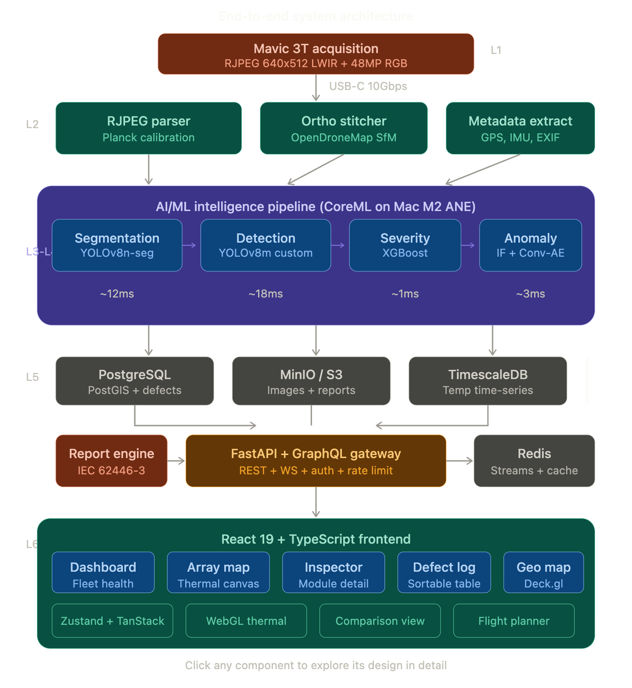

# Doctor Doom Project

**Thermal Panel Inspection System** - Autonomous solar panel defect detection using drone thermal imagery.



## Overview

Doctor Doom is a comprehensive microservices architecture for processing thermal imagery from solar panel inspections. The system ingests RJPEG thermal images from DJI Mavic 3T drones, runs a four-stage ML cascade for defect detection, and generates detailed inspection reports.

## Architecture

### Services

| Service | Port | Description |
|---------|------|-------------|
| `api-gateway` | 8000 | Central API entry point |
| `ml-inference` | 8001 | Four-stage ML defect detection |
| `report` | 8002 | PDF/HTML/JSON report generation |
| `notify` | 8003 | Email/SMS/Webhook notifications |
| `geo` | 7800 | Spatial data (PostGIS) & telemetry |
| `ingest-worker` | 8005 | L2 ingestion pipeline |
| `auth` | 8004 | JWT authentication & authorization |

### Infrastructure

| Component | Purpose |
|-----------|---------|
| Redis Streams | Message bus (4 channels) |
| PostgreSQL + PostGIS | Spatial data storage |
| TimescaleDB | Module telemetry time-series |
| MinIO | Local S3-compatible object storage |

### Redis Streams Channels

```
thermal:ingest      → Raw thermal images for processing
thermal:calibrated  → Calibrated images for ML inference
defect:detected     → Defect detection jobs
report:requested    → Report generation jobs
```

## Quick Start

### Prerequisites

- Docker & Docker Compose
- Python 3.11+ (for local development)
- 16GB RAM minimum (32GB recommended)

### Installation

1. **Clone the repository**
```bash
git clone https://github.com/your-org/doctor-doom-project.git
cd doctor-doom-project
```

2. **Configure environment**
```bash
cp .env.example .env
# Edit .env with your configuration
```

3. **Start all services**
```bash
docker compose up -d
```

4. **Verify health**
```bash
curl http://localhost:8000/health
```

### Access Services

| Service | URL |
|---------|-----|
| API Gateway | http://localhost:8000 |
| API Docs (Swagger) | http://localhost:8000/docs |
| MinIO Console | http://localhost:9001 |
| PostgreSQL | localhost:5432 |
| Redis | localhost:6379 |

## Development

### Run individual service locally

```bash
cd services/api-gateway
pip install -r requirements.txt
uvicorn main:app --reload --port 8000
```

### Run tests

```bash
# All services
docker compose -f docker-compose.test.yml up

# Individual service
cd services/api-gateway
pytest
```

### Build specific service

```bash
docker compose build api-gateway
```

## API Usage

### Authentication

```bash
# Register
curl -X POST http://localhost:8000/api/v1/auth/register \
  -H "Content-Type: application/json" \
  -d '{"email": "user@example.com", "password": "secure123", "full_name": "Test User"}'

# Login
curl -X POST http://localhost:8000/api/v1/auth/login \
  -H "Content-Type: application/json" \
  -d '{"email": "user@example.com", "password": "secure123"}'
```

### Submit Thermal Image

```bash
curl -X POST http://localhost:8000/api/v1/ingest/thermal \
  -H "Authorization: Bearer YOUR_TOKEN" \
  -H "Content-Type: application/json" \
  -d '{"image_id": "img_001", "module_id": "mod_001", "inspection_id": "insp_001"}'
```

### Get Defects

```bash
curl http://localhost:8000/api/v1/defects?severity=critical
```

### Generate Report

```bash
curl -X POST http://localhost:8000/api/v1/reports/generate \
  -H "Authorization: Bearer YOUR_TOKEN" \
  -d "site_id=site_001&inspection_id=insp_001"
```

## Deployment

### Edge Deployment (Mac M2)

The complete stack runs offline on Mac M2 with CoreML acceleration:

```bash
# On edge device
docker compose -f docker-compose.edge.yml up -d
```

**Performance:** <35ms inference per module

## Data Model

### Core Entities

```
sites (1) ──→ (N) modules
modules (1) ──→ (N) defects
sites (1) ──→ (N) inspections
inspections (1) ──→ (N) thermal_images
```

All spatial entities use PostGIS `GEOMETRY` columns for efficient geospatial queries.

## Monitoring

### Health Checks

```bash
# All services
for port in 8000 8001 8002 8003 8004 7800; do
  curl http://localhost:$port/health
done
```

### Logs

```bash
# All services
docker compose logs -f

# Specific service
docker compose logs -f ml-inference
```

## Security

- JWT-based authentication
- Role-based access control (RBAC)
- Password hashing with bcrypt
- Container security scanning with Trivy

## Contributing

1. Create feature branch: `git checkout -b feature/my-feature`
2. Make changes and write tests
3. Run linting: `ruff check .`
4. Submit pull request

## License

Proprietary - All rights reserved

## Support

For issues and questions, open an issue on GitHub or contact the development team.
