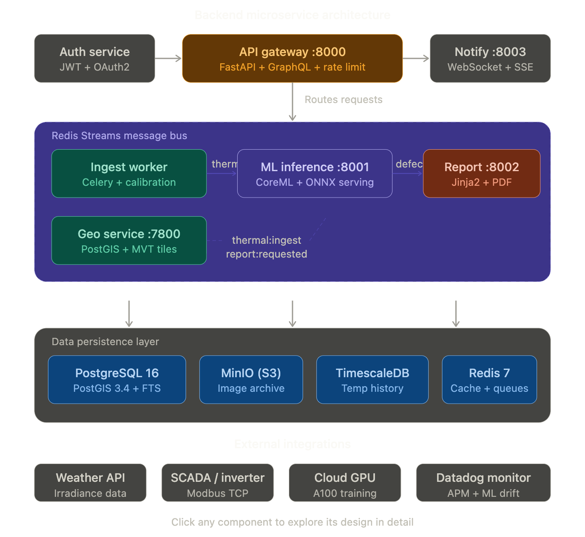
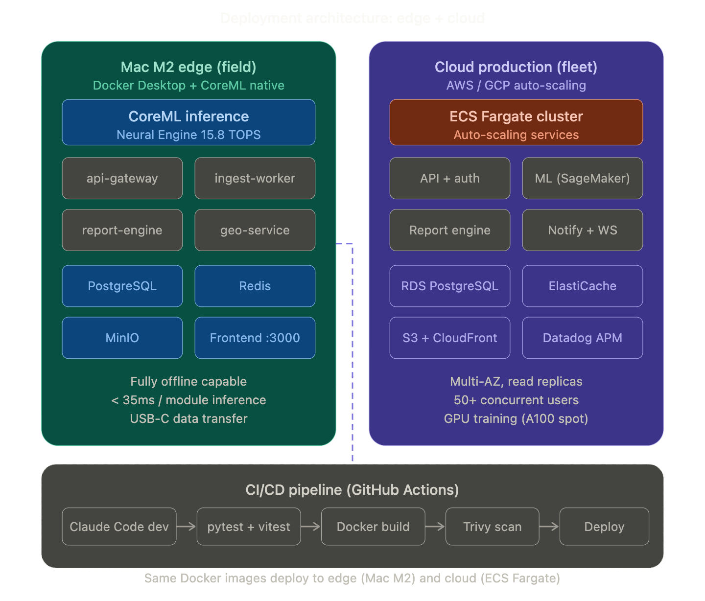

Let me build a comprehensive interactive architecture walkthrough. I'll break the full system into layered diagrams you can step through.That's the complete six-layer overview. Now here's how the seven backend microservices communicate through the Redis Streams message bus:Next, here's the dual deployment architecture showing how the same system runs on the Mac M2 in the field versus the cloud for fleet management:Finally, here's the data model showing how the six core entities relate with their key columns:That's the complete system architecture across four diagrams. Here's what each covers:

**Diagram 1 — End-to-end system** maps all six layers from Mavic 3T capture through the React frontend, with every component clickable for deep-dive detail. The three L2 ingestion services (RJPEG parser, orthomosaic stitcher, metadata extractor) feed into the four-stage ML cascade, which writes to three persistence stores, served through the FastAPI gateway to seven frontend views.

**Diagram 2 — Backend microservices** shows the seven independently deployable services (`api-gateway:8000`, `ml-inference:8001`, `report:8002`, `notify:8003`, `geo:7800`, `ingest-worker`, `auth`) communicating through four Redis Streams channels (`thermal:ingest`, `thermal:calibrated`, `defect:detected`, `report:requested`). The data persistence layer underneath uses PostgreSQL with PostGIS for spatial defect queries, MinIO for S3-compatible image storage, TimescaleDB for temperature time-series, and Redis for caching and job queues.

**Diagram 3 — Deployment** shows the dual-target architecture: the Mac M2 edge deployment runs the complete stack offline via Docker Desktop with CoreML native inference at <35ms/module, while the cloud production deployment scales on ECS Fargate with SageMaker ML serving, RDS Multi-AZ, S3 + CloudFront, and Datadog monitoring. Both targets share the same Docker images deployed through the GitHub Actions CI/CD pipeline (Claude Code → test → build → scan → deploy).

**Diagram 4 — Data model** renders the six-entity ER diagram: `sites` → `modules` → `defects` with PostGIS geometry columns on every spatial entity, `inspections` producing `thermal_images` linked to modules, and `module_telemetry` as a TimescaleDB hypertable for degradation tracking over time.É
